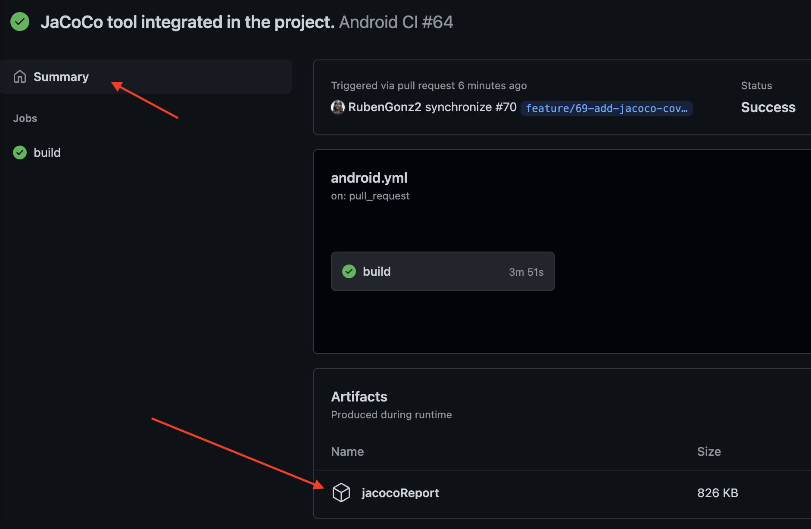
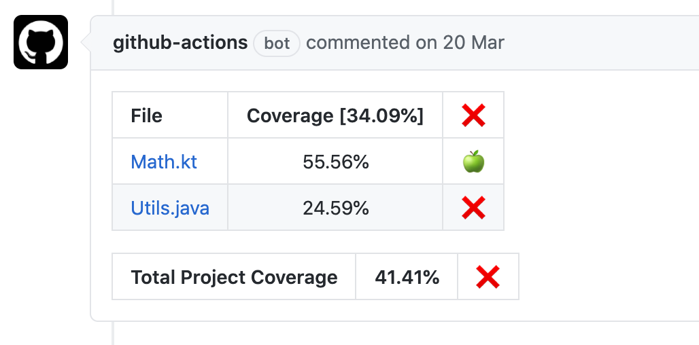

# JaCoCo

JaCoCo is an open-source toolkit for measuring and reporting Java code coverage.

Of course, it's compatible with Kotlin code too. That is very important on **`Los Androides`**.

## Resources used to implement this solution

- https://medium.com/nerd-for-tech/setup-jacoco-code-coverage-with-your-multimodule-android-app-kotlin-a0f82573a1
- https://thsaravana.github.io/blog/jacoco-single-coverage-for-multi-module/
- https://github.com/Madrapps/jacoco-report
- https://github.com/actions/upload-artifact
- 

# Relevant information in the JaCoCo Coverage Report
You can create a report in different formats:
- xml: usually used to feed other tools because it's easier to analyze by tools.
- csv: usually used to feed other tools because it's easier to analyze by tools.
- html: very useful to read the report.

In the implemented solution we're creating the *xml* and *html* reports. 
The *xml* will be used to analyze the coverage and publish the percentage in the PR.
The *html* is very useful to check it manually.

### HTML report
You can see in the first screen the information grouped by package.


If you enter in a group, you will see the information for all the contained classes inside the package.


If you enter in a class, you will see the lines tested (green), the code that is tested, by you need to test specific alternatives of the 
code (yellow), the untested code (red), and the not testable code without any color. In this example, most of the code is covered, 
the `ViewState.Content` is tested only one branch of two, because we have tested this class sending a explicit items param, but we have not tested 
with the default value, and the `ViewState.Error` was not tested. Tested means that this code was used for some of the tests we have run in the project.


So you could decide to create new tests depending on this useful information.

You can find more information here: 
- https://www.eclemma.org/userdoc/annotations.html

# JaCoCo in multi-module project

The default way to run JaCoCo to create the coverage report is doing a task for each module. But it is very useful to merge all the reports and have
only one report with the coverage of the full project.

The multi-module feature is implemented in **`Los Androides`**, even if we have only one module yet. This is why in the `jacoco.gradle` file you can
find a task for each module with the content empty: debugCoverage --> We only want to create the task to create the binary files with the result of
the tests that we will use later to elaborate the merged report. The `allDebugCoverage` task search for all the UnitTests and UI Tests reports and
takes all the source code to create a report with all the information.

# Using JaCoCo locally

As you can see in the `root/gradle-script/jacoco.gradle` file, this `allDebugCoverage` task depends on the `testDebugUnitTest` and
`connectedDebugAndroidTest` for all the modules in the project. The dependency with the `connectedDebugAndroidTest` is only applied in local builds.

So `testDebugUnitTest` and `connectedDebugAndroidTest` tasks for all the modules will be executed before creating the report.

You can run the JaCoCo task to create the testing coverage report very easily. You only need to run the task:

```shell
./gradlew allDebugCoverage
```

After running this task, you can find the report in both formats (XML and HTML) in this path:

`rootProject/build/reports/jacoco/allDebugCoverage`

# Using JaCoCo in Github

We are running the JaCoCo task during the pipeline. We can define a minimum coverage to accept the merge on the main branch, to avoid including
untested code, but for now this feature is not enabled in this project.

After creating the JaCoCo report, we're publishing the * html* report as an artifact in the GitHub PR. You can find the report in the details of 
the PR in the Summary/Artifacts section, called `jacocoReport`.



The next step in the PR is to add a comment in the PR with the coverage of the changes files and the global one. For this comment 
we're defining a minimum for both values:
- min-coverage-overall: 30 
- min-coverage-changed-files: 50

This minimum is only to have a visual status of the coverage, but the build will not be blocked if your values are under the minimum.


